# python-challenge

This project is an assignment submission for the University of Minnesota Data Analytics and Visualization Boot Camp. In this assignment, students were tasked with creating a script using Python for each of two datasets. The scripts were set up to perform certain tasks, and each script must export a text file with the same information that would be printed to the terminal. To start, students were tasked with creating folders called PyBank and PyPoll and adding two additional folders and a python file to each folder. Tasks like this would be expected to be repeated, so making a script usable for a generic dataset formatted in the same way is critical in saving future time and headaches.

## PyBank

For the PyBank instructions, students were tasked with creating a script that would analyze a csv file (budget_data.csv) to calculate the following information:
- The total number of months included in the dataset
- The net total amount of "Profit/Losses" over the entire period
- The changes in "Profit/Losses" over the entire period, and then the average of those changes
- The greatest increase in profits (date and amount) over the entire period
- The greatest decrease in profits (date and amount) over the entire period

To start, the script needs to be able to read a csv file. Importing os and csv allows the script to create a path to the csv file in order to open it.
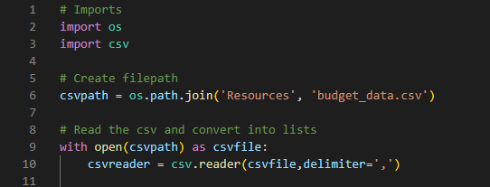

Once the csv file is open, the script will need to read through the file and store the data from it into lists to be used for calculations and printing. At this point, I thought it would be appropriate to set up the script to print the report header, total months, and the total amount of Profit/Losses.
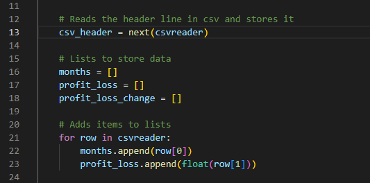
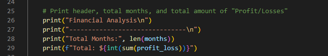

Next, the script must be able to track the changes in Profit/Losses. Then, it must be able to find the average change, the greatest increase, and the greatest decrease. In order to do that, I've created a for loop to run through the profit_loss list to create a list of profit_loss_change. From there, the script will then be able to do the requested calculations by using the data in the new profit_loss_change list. The resulting data would also have to be matched with its correlating dates for printing.
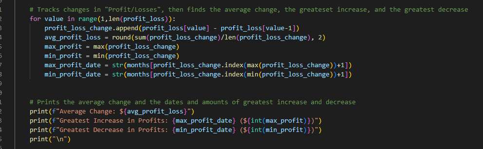

The results are set up to print to the terminal. The results must also be exported to a text file in a different folder location, resulting in the following script setup to finish the assignment.
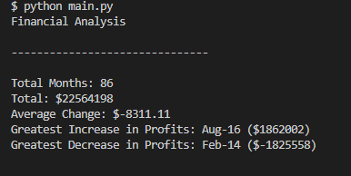
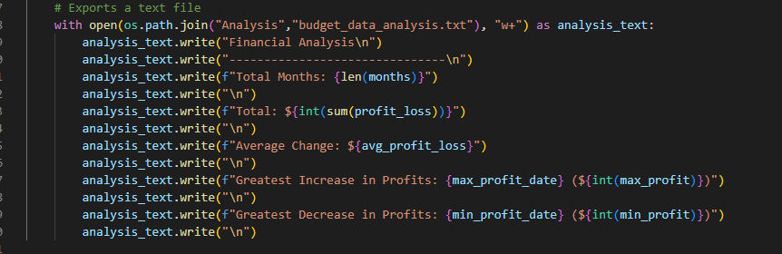

## PyPoll

For the PyPoll instructions, students were tasked with creating a script that would analyze a csv file (election_data.csv) to calculate the following information:
- The total number of votes cast
- A complete list of candidates who received votes
- The percentage of votes each candidate won
- The total number of votes each candidate won
- The winner of the election based on popular vote

This assignment starts the same way as the last. The same imports are needed, and the script to set the path and read the file are pretty much the same. However, there is a new list that has been added for unique candidates. I'll touch more on this in the next part of the script.
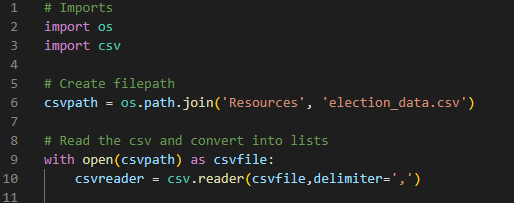
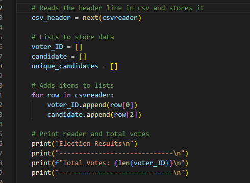

In order to do a proper vote count and print the candidates and votes appropriately, the script needs to pull out the unique candidates from the candidates list. In this assignment, there are only three candidates running, so out of the thousands of votes cast, they are only cast for three different individuals. The script is set up to count the total votes cast, and then separate those votes into a list under the appropriate candidate. I decided that the easiest way to do this from this point would be to compare the candidate's name in unique_candidates to whatever name was showing up in the candidates list for each vote cast, using a for loop.
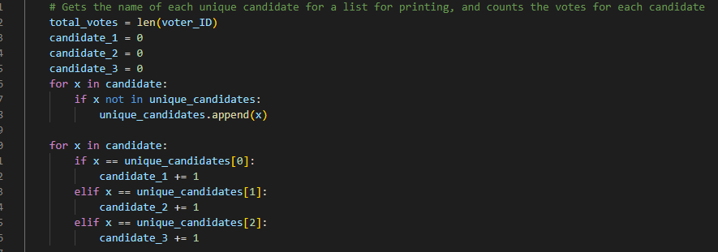

Once each candidate's votes were counted, the script would need to be able to calculate the percentage of the total vote that each candidate received in order to print that result. From that point, the script would need to compare each candidate's number of votes in order to correct produce a winner of the election.
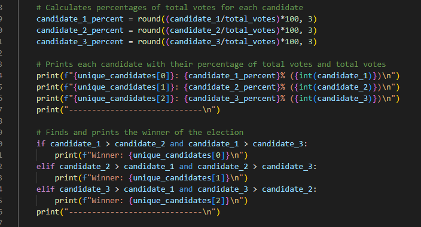
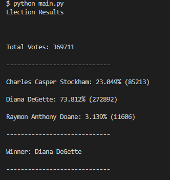

This result would also need to be exported to a text file. I decided to set this export up in a slightly different way, allowing a comparison of the two printed results in terms of spacing.
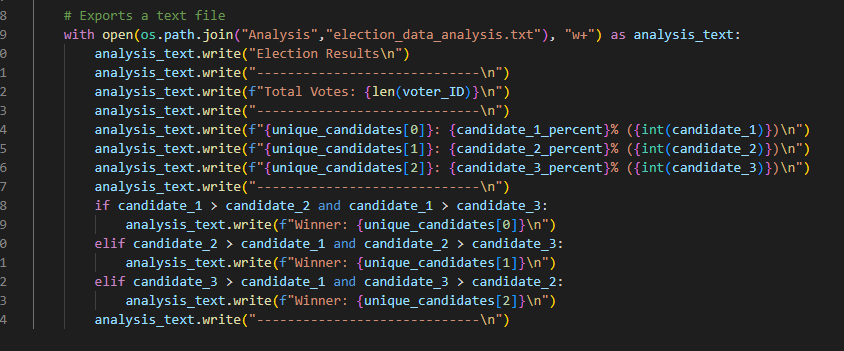

## Takeaways

In this project, it's easy to see how creating a running a script to do tasks like vote counting save time and effort. These are the types of tasks that analysts are asked to complete on a regular basis, so having the skills to create and runs these scripts quickly makes the analyst's job easier and saves the companies money by not wasting so much time on doing these tasks by hand. Many datasets are far too large for Excel to handle, so being able to use Python increases a company's ability to run analysis.

